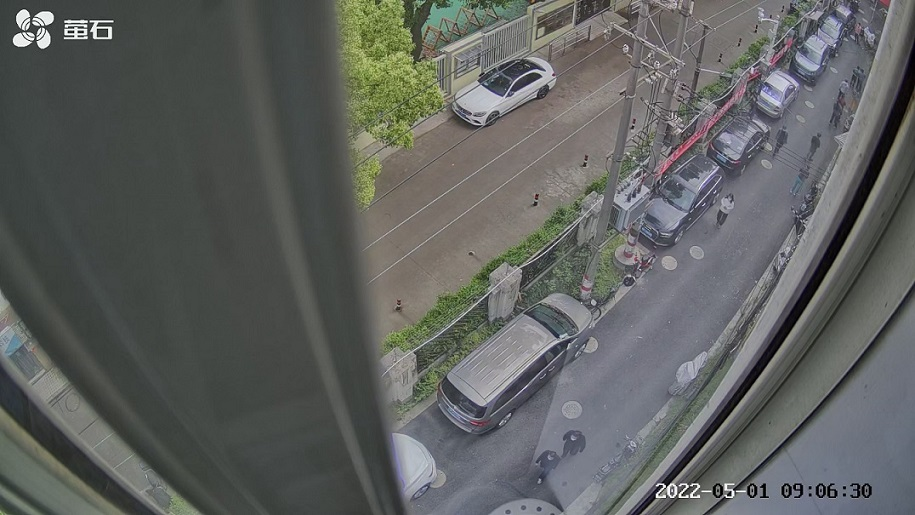
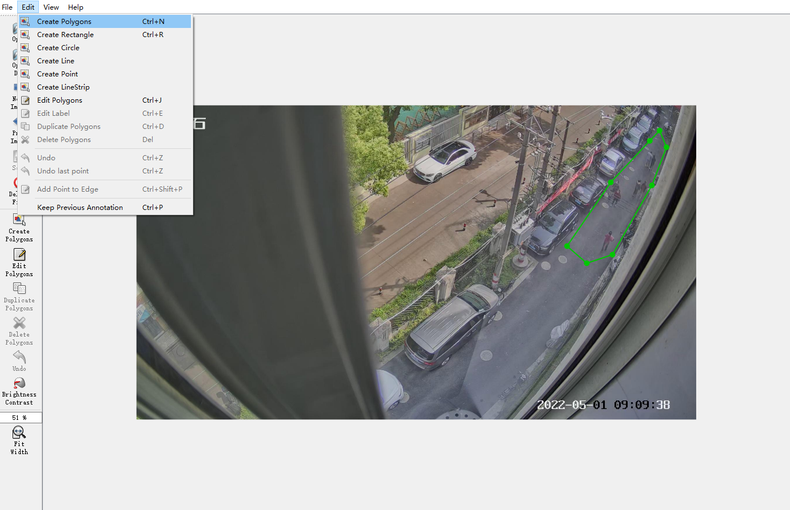

### 核酸检测排队监测应用

- 应用功能描述
    - 利用 `Khadas VIM3` 计算机与 `OpenCV` 智能视频识别技术制作提示一套自动识别排队装置。每次核酸排队时只需要启动系统，系统就可以自动识别排队人员情况，当监测到人少的时候系统自动发邮件信息提示，并且附上排队图片截图供人工二次确认。
   
    - 需要提前配置监控区域的原始图像：

   

    - 智能识别后的结果，通过邮件提醒的示例图：

   <div align=center></div>


- 应用架构说明
    - 使用了 **`opencv`** 以下功能，实现了对核酸检测队伍在设定时间范围内的监控
        - 视频解码，支持输入文件视频（**mp4**、**avi**）、视频流（**rtsp**）、电脑前置摄像头
        - `AI` 推理功能，使用 **OpenCV DNN** 模块对 `AI` 模型推理
        - 图像运算功能，利用**findContour**、**pointPolygonTest** 用来对监控信息进行分析和判断
    - 工程目录结构

* * *

```
COVID-19_Check_Queue_Monitor
     - covid19_check_queue_monitor.py 主程序
     - model                 存放AI模型（onnx格式），已放置 OpenCV Zoo 提供的Yolov5模型
     - video                 存放文件视频
     - app                   应用代码文件夹
       - email_reminder.py   邮件发送
       - get_monitor_roi.py  获取监控区域配置、判断人体位置
       - infer_utils.py      模型AI推理脚本
       - yolov5.py           模型信息封装脚本
       - read_cfg_yml.py     yaml配置文件解析脚本
       - read_write_stack.py 多线程读取 stack （解码数据和监控信息）的脚本
       - record_queue_person_nums.py 记录监控区域内的核酸人数，并将其写入record文件夹下的 xlsx 表格
       - config
         - params.yml        应用配置参数文件，包括邮件信配置、监控配置、视频输入配置、模型配置
         - region.json       监测区域配置文件，基于 assets/regino.jpg 的源头图片，支持配置不规则的多边形
     - record                统计人数数据并记录在xlsx文件中
     - tmp                   存储截图图像画面
```

* * *

- 运行环境要求
    
    - `python3>= 3.6.9` ;
    - `yaml >5.1`;
    - `openpyxl` ;
    - `Opencv>=4.5.3，推荐 4.5.5.64`
    - 支持运行的平台 `windows`、`ubuntu`、`OSX`
    - 一键安装命令:  `pip3 install opencv-python==4.5.5.64 pyyaml openpyxl -i https://pypi.tuna.tsinghua.edu.cn/simple`

- 运行 `Sample` 视频
    
    - 以测试视频 `video/test.mp4` 为输入
        
    - 参照应用配置，修改`app/config/params.yml` 里，关于**邮件**的配置。其余配置保持不变
        
        - 一键执行命令： `python3 covid19_check_queue_monitor.py`
    - 若想**中断**运行中的程序，直接在键盘按下：`ctrl+c`，需要连按 `2`次
        
    - 人员识别结果记录保存在 `record/detect_result.xlsx`
        
- 输入分析其他场景视频
    
    - 打开`app/config/params.yml` 修改应用参数
        - 视频输入支持三选一： `RTSP`，视频媒体比如 `test.mp4` 和 `PC` 的前置摄像头
        - 监测人员阈值配置
        - 邮件发送账户与密码、接收账户
        - `AI` 模型参数：，型识别类型、置信度阈值、`iou` 阈值
    - 修改排队监测区域，更新 `app/config/region.json`
        - 从视频（或者）视频流中获取任一一帧画面保存下来，比如仓库该路径： `assets/region.jpg`。基于这张图像，使用 标注软件 **`labelme`**（`windows` 系统下的该软件链接: https://pan.baidu.com/s/16NmT_DPghnfbAZIAU07gIg 提取码: rwq6），对图像进行标注：选择 左上角的`Edit->Create Polygons`，即可在图像上标注多边形区域（下图右侧**绿色**多边形），如下图所示。标注完成后，会弹出一个框需要输入标签名，并不重要，可以随意输入，比如：`covid19_roi`。标注保存的文件默认会与图像前缀名相同，为 `region.json`，将该 `json` 文件放置在 `app/config` 目录下。具体的 `labelme` 软件多边形标注方法，可参考 [链接](https://jameslahm.github.io/labelme/)
    
       